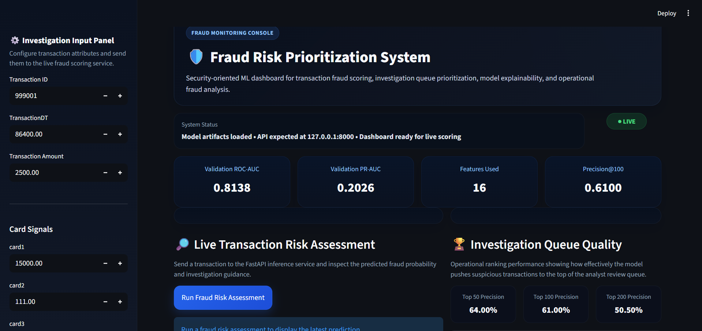
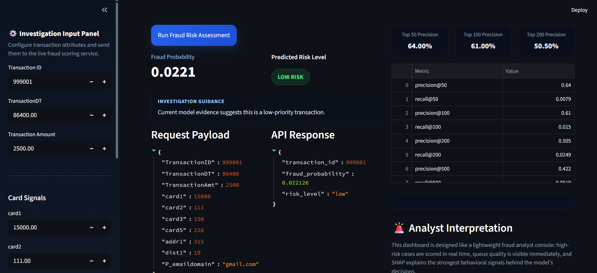
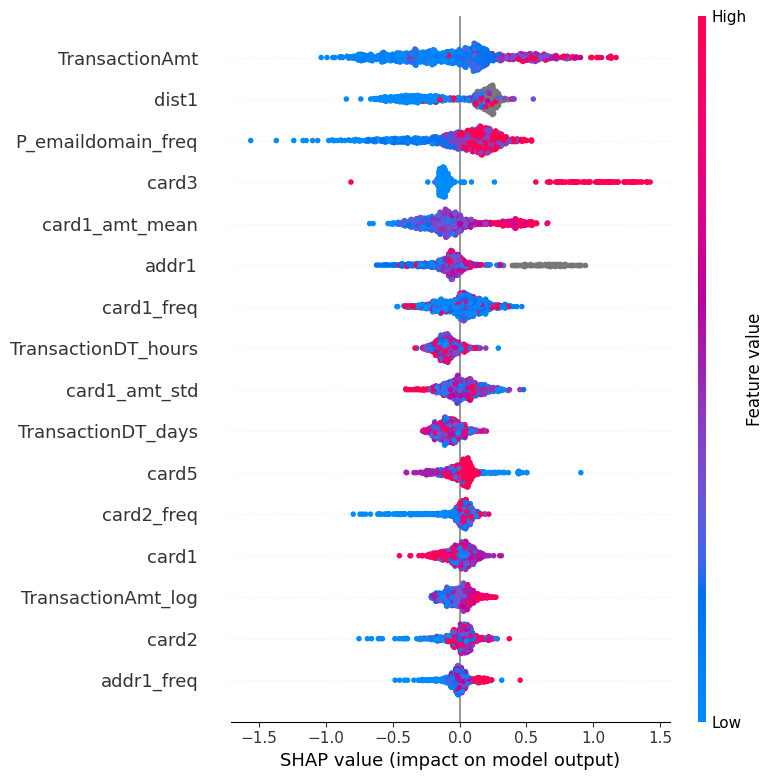

# 🛡️ Fraud Risk Prioritization System

End-to-end Machine Learning system for **fraud prediction, investigation queue prioritization, drift monitoring, and explainable risk scoring**.

Designed to simulate how real fraud teams use ML to **prioritize suspicious transactions efficiently** instead of manually reviewing everything.

---

## 🚀 Key Highlights

✔ Time-aware validation split (realistic deployment simulation)
✔ Advanced feature engineering for fraud signals
✔ LightGBM model optimized for imbalanced tabular data
✔ Ranking-based evaluation (Precision@K)
✔ Drift monitoring for production reliability
✔ SHAP explainability for model transparency
✔ FastAPI inference API
✔ Streamlit fraud analyst dashboard

---

## 🎯 Problem Statement

Fraud investigation teams cannot manually review all transactions.

This system helps answer:

* Which transactions are most suspicious?
* Which cases should investigators prioritize?
* How effective is the ranking?
* Which features influence fraud predictions?
* Is transaction behaviour changing over time?

---

## 📊 Model Performance

| Metric        | Value      |
| ------------- | ---------- |
| ROC-AUC       | **0.8138** |
| PR-AUC        | **0.2026** |
| Precision@50  | **0.64**   |
| Precision@100 | **0.61**   |
| Precision@200 | **0.505**  |

Dataset fraud rate ≈ **3.5%**

Precision@100 = **61%** → ~17× improvement over random selection.

---

## 🧠 Feature Engineering

Key engineered signals:

* log-transformed transaction amount
* frequency encoding for high-cardinality variables
* card-level behavioral aggregates
* time-based fraud patterns
* distance anomaly signals

These help the model capture **behavioral deviations**, a strong indicator of fraud.

---

## 🖥️ Dashboard

### Fraud Analyst Console



---

### Prediction Example



---

### SHAP Explainability



---

## 🧱 Architecture

```
Raw Transaction Data
↓
Feature Engineering Pipeline
↓
LightGBM Fraud Model
↓
Fraud Probability Score
↓
Ranking Layer (Precision@K)
↓
Drift Monitoring
↓
FastAPI Inference API
↓
Streamlit Dashboard
```

---

## ⚙️ Tech Stack

### Machine Learning

* Python
* scikit-learn
* LightGBM
* SHAP

### Backend

* FastAPI

### Frontend

* Streamlit

### Data Processing

* pandas
* numpy

---

## ▶️ How to Run

### 1. Install dependencies

```bash
pip install -r requirements.txt
```

### 2. Place dataset

Put files inside:

```
data/raw/
```

Required files:

* train_transaction.csv
* train_identity.csv

### 3. Create train/validation split

```bash
python -m src.data.make_splits
```

### 4. Train model

```bash
python -m src.models.train_lgbm
```

### 5. Evaluate ranking

```bash
python -m src.ranking.evaluate_ranking
```

### 6. Generate explainability plots

```bash
python -m src.models.explain_lgbm
```

### 7. Start API

```bash
uvicorn api.main:app --reload
```

### 8. Run dashboard

```bash
streamlit run dashboard/app.py
```

---

## 📌 Example API Request

```json
{
  "TransactionID": 999001,
  "TransactionDT": 86400,
  "TransactionAmt": 2500,
  "card1": 15000,
  "card2": 111,
  "card3": 150,
  "card5": 226,
  "addr1": 315,
  "dist1": 19,
  "P_emaildomain": "gmail.com"
}
```

---

## 💡 Why This Project Stands Out

Most ML projects stop at training a model.

This project demonstrates:

* real-world tabular ML workflow
* decision-oriented ranking metrics
* production considerations (drift)
* interpretable predictions
* end-to-end ML system design

---

## 🔭 Future Improvements

* batch inference endpoint
* automated retraining triggers
* feature store integration
* real-time streaming pipeline
* cloud deployment

---

## 👤 Author

Flagship ML Engineer portfolio project focused on:

* feature engineering depth
* model reliability
* real-world decision support systems
